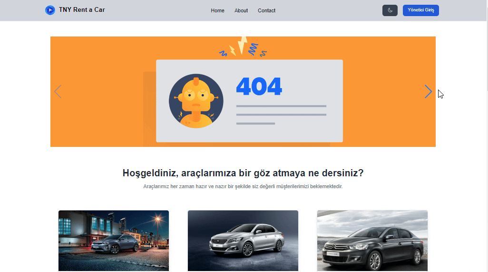

# Hi I'm Nurdoğan Bahadır 👋. Welcome to my Rent a Car Project with React.

This project was developed with React and TailwindCSS and react and plugins were used. Thanks to MockAPI, users who log in to the application can add new tools or delete or update existing tools if they wish. Again, thanks to MockAPI, this updated information is presented to customers on the main page of the web page. In this way, the administrator can control the web page. Other plugins used in the project are shared below.

# Live Link of the Project

[Click Me](https://tny-rentacar-nurdoganbahadir.netlify.app)

# Libraries and Technologies I use

- TailwindCSS
- Flowbite
- Swiper
- react-toastify
- mockAPI
- useState
- useEffect
- react-router-dom

# How to install

In the project directory, open the terminal and run:

### `npm install`

This will install the necessary dependencies. After that, you can run:

### `npm start`

# How does my project look

